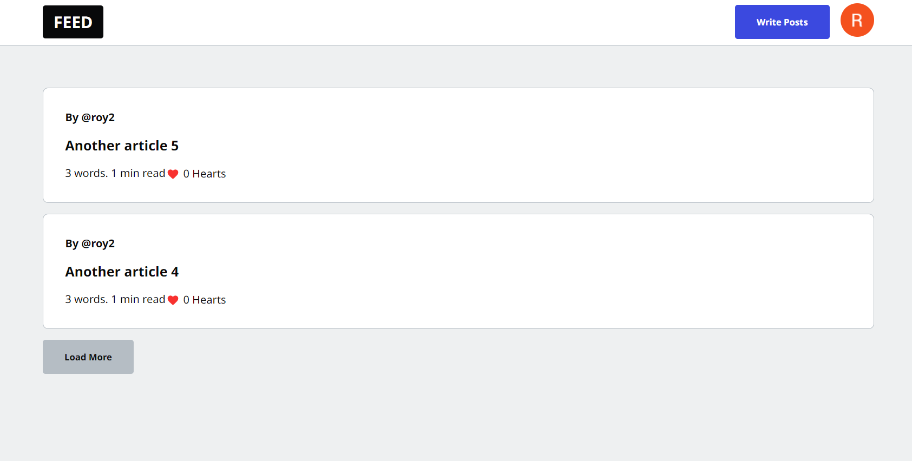
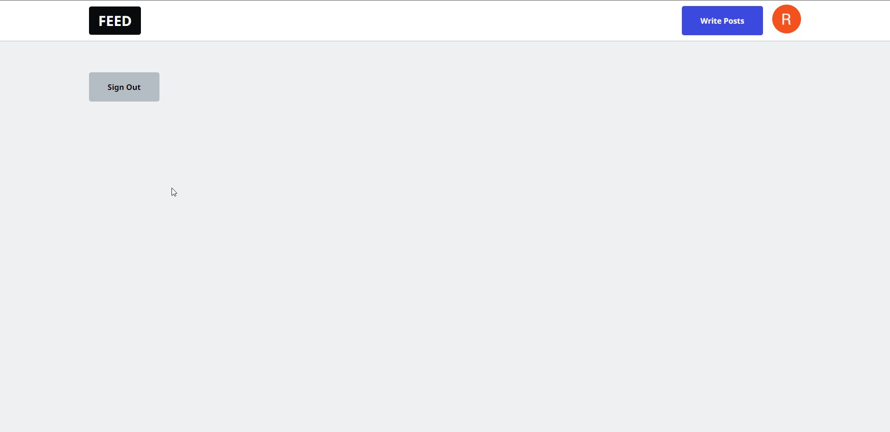

<h1 align="center">Fire Next</h1>

## 🏁Description

<div style="text-align: justify">Fire Next is a Bot-friendly and SEO-optimized Web App Built with Next.js. It was inspired by [DEV Community 👩‍💻👨‍💻](https://dev.to/), a social bloging platform. Authors can create content under their custom username, then publish publicly with SEO-friendly rendering, while readers can heart or like posts in realtime</div>

 

## 📺Live Demo

<p>You can give it a try by heading to the following URL</p>

### https://fire-next-livid.vercel.app/

## 💫Features

- 👨‍🎤 Custom Firebase usernames
- 📰 Bot-friendly content (SEO)
- 🦾 SSR (Server-Side Rendering), SSG (Static Site Generation), and ISR (Incremental Static Regeneration) techniques
- 🔥 Firestore realtime CRUD and data modeling
- ⚛️ Reactive forms with react-hook-form
- 📂 Image file uploads
- 💞 Realtime hearts / likes
- 🚀 Security & Deployment

## ⛏️Built With

- [React.js](https://dart.dev/) - A JavaScript library for building user interfaces
- [Next.js](https://flutter.dev/) - The React Framework
  for Production
- [Firebase](https://firebase.google.com/) - A BaaS backed by Google

## ⛓️Prerequisites

- [Node.js](https://nodejs.org/) v16.14.0 or higher

## 🚀Run

#### Clone repository

```
git clone https://github.com/MisterRoy/fire-next.git
```

#### Install dependencies

```
npm install
```

#### Launch

```
npm run dev
```

## 👨🏾‍💻Author

- [Mr. Roy](https://github.com/MisterRoy)

## 👋🏿Acknowledgments

I built this app thanks to Jeff's [awesome course](https://fireship.io/courses/react-next-firebase/).
You should definitely check out his [YouTube Channel](https://www.youtube.com/c/Fireship).

- [Jeff Delaney](https://github.com/codediodeio)
- React team at Meta (former Facebook)
- All authors of the differents npm packages used in this project
